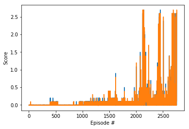

# Report

In order to train the network I used the following parameters:

# Parameters

BUFFER_SIZE = int(1e5)  
which is the replay buffer size
BATCH_SIZE = 128  
which is the batch size
GAMMA = 0.99  
This is the discount factor used for the rewards
TAU = 1e-3   
this paramters controls the soft-update for target parameters
LR_ACTOR = 1e-4   
this is the learning rate for the actor
LR_CRITIC = 1e-3  
this is the learning rate for the criti
WEIGHT_DECAY = 0.0  
and this is the parameter that controls weight decay  

For the actor I used a 3 layer neural network with the first hidden layer having 400 units and the second hidden layer having 300 units. In the actor I also add a batch normalization after each layer. I used relu activation functions for this network
The same architecture was used for the critic we did not introduce batch normalization. You can see the code in model.py

# Results

Here is a graph of the rewards over episodes:

As you can see there is alot of noise during training, with a quite few swings. It ends up solving the environment in 2756 episodes.

# Improvements
I think it would be interesting to see the performance of PPO on this environment. Also, I trained this on a single agent. It would be interesting to see the performance of this in a multi-agent setting. It would also be interesting to test the performance of A3C and D4PG. You can find more information on D4PG here: https://openreview.net/pdf?id=SyZipzbCb
